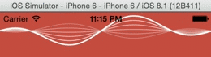

ZLSinusWaveView
===============

A Siri like voice visualization view using EZAudio. Modified from [SISinusWaveView](https://github.com/raffael/SISinusWaveView) for iOS.

Preview
---

CocoaPods
---
You can install `ZLSinusWaveView` through CocoaPods adding the following to your Podfile:

    pod 'ZLSinusWaveView'

Usage
---
Check out the [demo app](https://github.com/zhxnlai/ZLSinusWaveView/tree/master/EZAudioPlayFileExample) for an example.

Dependencies
---
ZLSinusWaveView is a subclass of `EZAudioPlot`. It requires [EZAudio](https://github.com/syedhali/EZAudio).

License
---
ZLSinusWaveView is available under the BSD license.

- Copyright (c) 2014, Zhixuan Lai
- Copyright (c) 2013 Raffael Hannemann 
- All rights reserved.
